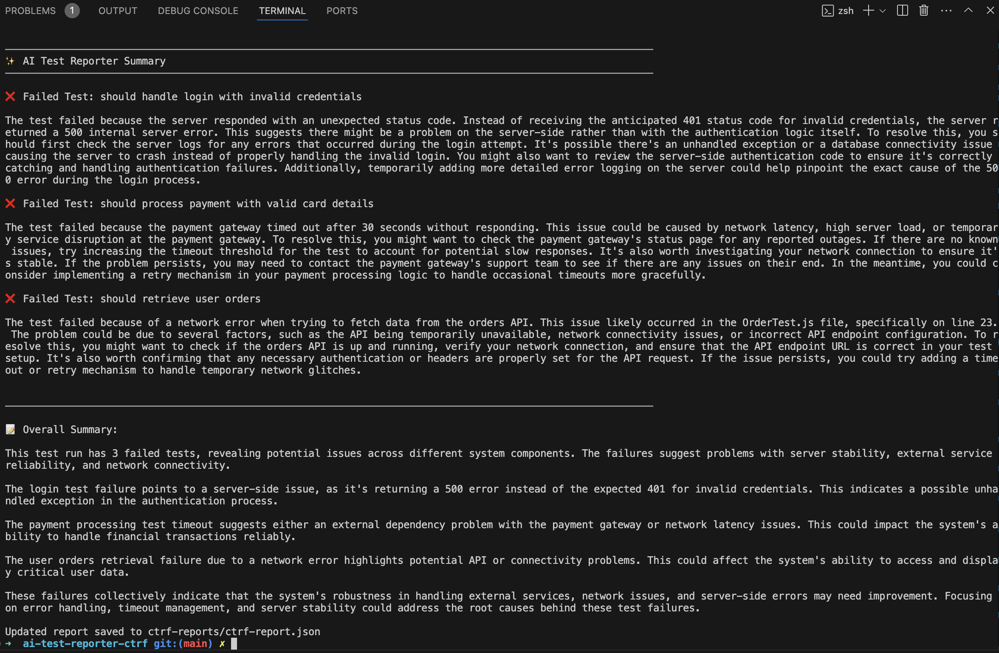
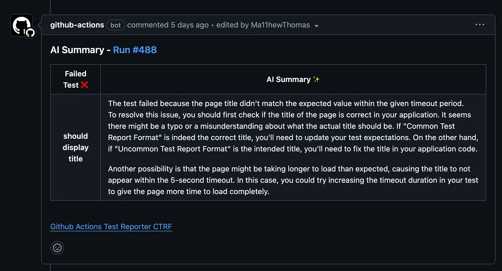

# AI Test Reporter

AI Test Reporter is a powerful tool that generates intelligent summaries of test results using a wide range of AI models. With access to over 300 models through various providers (OpenAI, Anthropic Claude, Google Gemini, Mistral, Perplexity, OpenRouter, and more), it analyzes failing tests and provides actionable insights about what went wrong and how to fix it.

<div align="center">
<div style="padding: 1.5rem; border-radius: 8px; margin: 1rem 0; border: 1px solid #30363d;">
<span style="font-size: 23px;">💚</span>
<h3 style="margin: 1rem 0;">CTRF tooling is open source and free to use</h3>
<p style="font-size: 16px;">You can support the project with a follow and a star</p>

<div style="margin-top: 1.5rem;">
<a href="https://github.com/ctrf-io/ai-test-reporter">

</a>
<a href="https://github.com/ctrf-io">

</a>
</div>
</div>

<p style="font-size: 14px; margin: 1rem 0;">

Contributions are very welcome! <br/>
Explore more <a href="https://www.ctrf.io/integrations">integrations</a> <br/>
<a href="https://app.formbricks.com/s/cmefs524mhlh1tl01gkpvefrb">Let us know your thoughts here</a>.

</p>
</div>

## Why Use AI Test Reporter?

- 🤖 **Smart Analysis**: Get AI-powered explanations of why tests failed and suggestions for fixes
- 🔌 **Multiple Providers**: Choose from 300+ AI models across different providers
- 🛠️ **Custom Services**: Use your own OpenAI-compatible services (in-house solutions, LocalAI, Ollama, etc.)
- 💰 **Cost-Effective Options**: Start with providers offering free credits like Mistral and Google Gemini
- 🔄 **Developer Tool Integration**: Seamlessly integrate AI summaries into your workflow:
  - GitHub Actions and Pull Requests
  - Slack / Teams notifications
  - And more through standardized CTRF reports
- 🎯 **Consolidated Insights**: Get high-level summaries of test suite failures to identify patterns and root causes
- ⚡ **Framework Agnostic**: Works with any testing framework through CTRF reports
- 📊 **Flexible Reporting**: AI summaries are embedded in your CTRF JSON report, allowing you to:
  - Include AI analysis in your existing reporting workflows
  - Programmatically customize how and where summaries appear in your Developer Tools

## Models

> [!TIP]
> The following integrations are available with free tiers so are great to try out AI test reporter:
>
> - **Google Gemini**: Offers a free tier with lower rate limits. [Pricing details](https://ai.google.dev/pricing#2_0flash)
> - **Mistral AI**: Provides a free API tier to explore the service. [Tier details](https://docs.mistral.ai/deployment/laplateforme/tier/#usage-tiers)

You can use any of the models supported by the following providers:

- OpenAI
- Anthropic Claude
- Google Gemini
- Mistral
- Grok
- DeepSeek
- Azure OpenAI
- Perplexity
- OpenRouter
- Custom OpenAI-compatible services (in-house solutions, LocalAI, Ollama, etc.)

You use your own API keys for the models you select.

## Usage

Generate a CTRF report using your testing framework. [CTRF reporters](https://github.com/orgs/ctrf-io/repositories) are available for most testing frameworks and easy to install.

**No CTRF reporter? No problem!**

Use [junit-to-ctrf](https://github.com/ctrf-io/junit-to-ctrf) to convert a JUnit report to CTRF

## OpenAI

Run the following command:

```bash
npx ai-ctrf openai <path-to-ctrf-report>
```

An AI summary for each failed test will be added to your test report.

The package interacts with the OpenAI API, you must set `OPENAI_API_KEY` environment variable.

You will be responsible for any charges incurred from using your selected OpenAI model. Make sure you are aware of the associated cost.

A message is sent to OpenAI for each failed test.

### Options

`--model`: OpenAI model to use (default: gpt-3.5-turbo).

`--systemPrompt`: Custom system prompt to guide the AI response.

`--additionalSystemPromptContext`: Additional context to append to the system prompt. This allows you to add extra instructions or context without replacing the entire system prompt.

`--additionalPromptContext`: Additional context to append to the user prompt. This allows you to add extra instructions

`--frequencyPenalty`: OpenAI frequency penalty parameter (default: 0).

`--maxTokens`: Maximum number of tokens for the response.

`--presencePenalty`: OpenAI presence penalty parameter (default: 0).

`--temperature`: Sampling temperature (conflicts with topP).

`--topP`: Top-p sampling parameter (conflicts with temperature).

`--log`: Whether to log the AI responses to the console (default: true).

`--maxMessages`: Limit the number of failing tests to send for summarization in the LLM request. This helps avoid overwhelming the model when dealing with reports that have many failing tests. (default: 10)

`consolidate`: Consolidate and summarize multiple AI summaries into a higher-level overview (default: true)

## Azure OpenAI

Run the following command:

```bash
npx ai-ctrf azure-openai <path-to-ctrf-report>
```

An AI summary for each failed test will be added to your test report.

The package interacts with the Azure OpenAI API, you must set `AZURE_OPENAI_API_KEY`, `AZURE_OPENAI_ENDPOINT`, and `AZURE_OPENAI_DEPLOYMENT_NAME` environment variable or provide them as arguments.

You will be responsible for any charges incurred from using your selected Azure OpenAI model. Make sure you are aware of the associated cost.

A message is sent to Azure OpenAI for each failed test.

### Options

`--model`: OpenAI model to use (default: gpt-3.5-turbo).

`--systemPrompt`: Custom system prompt to guide the AI response.

`--additionalSystemPromptContext`: Additional context to append to the system prompt. This allows you to add extra instructions or context without replacing the entire system prompt.

`--additionalPromptContext`: Additional context to append to the user prompt.

`--frequencyPenalty`: OpenAI frequency penalty parameter (default: 0).

`--maxTokens`: Maximum number of tokens for the response.

`--presencePenalty`: OpenAI presence penalty parameter (default: 0).

`--temperature`: Sampling temperature (conflicts with topP).

`--topP`: Top-p sampling parameter (conflicts with temperature).

`--log`: Whether to log the AI responses to the console (default: true).

`--maxMessages`: Limit the number of failing tests to send for summarization in the LLM request. This helps avoid overwhelming the model when dealing with reports that have many failing tests. (default: 10)

`consolidate`: Consolidate and summarize multiple AI summaries into a higher-level overview (default: true)

## Claude

Run the following command:

```bash
npx ai-ctrf claude <path-to-ctrf-report>
```

An AI summary for each failed test will be added to your test report.

The package interacts with the Anthropic API, you must set `ANTHROPIC_API_KEY` environment variable.

You will be responsible for any charges incurred from using your selected Claude model. Make sure you are aware of the associated costs.

A message is sent to Claude for each failed test.

### Claude Options

`--model`: Claude model to use (default: claude-3-5-sonnet-20240620).

`--systemPrompt`: Custom system prompt to guide the AI response.

`--additionalSystemPromptContext`: Additional context to append to the system prompt.

`--additionalPromptContext`: Additional context to append to the user prompt.

`--maxTokens`: Maximum number of tokens for the response.

`--temperature`: Sampling temperature.

`--log`: Whether to log the AI responses to the console (default: true).

`--maxMessages`: Limit the number of failing tests to send for summarization in the LLM request. This helps avoid overwhelming the model when dealing with reports that have many failing tests. (default: 10)

`consolidate`: Consolidate and summarize multiple AI summaries into a higher-level overview (default: true)

## Grok

Run the following command:

```bash
npx ai-ctrf grok <path-to-ctrf-report>
```

An AI summary for each failed test will be added to your test report.

The package interacts with the Grok API, you must set `GROK_API_KEY` environment variable.

You will be responsible for any charges incurred from using your selected Grok model. Make sure you are aware of the associated cost.

A message is sent to Grok for each failed test.

### Grok Options

`--model`: Grok model to use (default: grok-1).

`--systemPrompt`: Custom system prompt to guide the AI response.

`--additionalSystemPromptContext`: Additional context to append to the system prompt.

`--additionalPromptContext`: Additional context to append to the user prompt.

`--maxTokens`: Maximum number of tokens for the response.

`--temperature`: Sampling temperature.

`--log`: Whether to log the AI responses to the console (default: true).

`--maxMessages`: Limit the number of failing tests to send for summarization in the LLM request. This helps avoid overwhelming the model when dealing with reports that have many failing tests. (default: 10)

`consolidate`: Consolidate and summarize multiple AI summaries into a higher-level overview (default: true)

## DeepSeek

Run the following command:

```bash
npx ai-ctrf deepseek <path-to-ctrf-report>
```

An AI summary for each failed test will be added to your test report.

The package interacts with the DeepSeek API, you must set `DEEPSEEK_API_KEY` environment variable.

You will be responsible for any charges incurred from using your selected DeepSeek model. Make sure you are aware of the associated cost.

A message is sent to DeepSeek for each failed test.

### DeepSeek Options

`--model`: DeepSeek model to use (default: deepseek-coder).

`--systemPrompt`: Custom system prompt to guide the AI response.

`--additionalSystemPromptContext`: Additional context to append to the system prompt.

`--additionalPromptContext`: Additional context to append to the user prompt.

`--maxTokens`: Maximum number of tokens for the response.

`--temperature`: Sampling temperature.

`--log`: Whether to log the AI responses to the console (default: true).

`--maxMessages`: Limit the number of failing tests to send for summarization in the LLM request. This helps avoid overwhelming the model when dealing with reports that have many failing tests. (default: 10)

`consolidate`: Consolidate and summarize multiple AI summaries into a higher-level overview (default: true)

## Mistral

Run the following command:

```bash
npx ai-ctrf mistral <path-to-ctrf-report>
```

An AI summary for each failed test will be added to your test report.

The package interacts with the Mistral API, you must set `MISTRAL_API_KEY` environment variable.

You will be responsible for any charges incurred from using your selected Mistral model. Make sure you are aware of the associated cost.

A message is sent to Mistral for each failed test.

Mistral offers free API credits upon signup, making it a great option to test the tool without immediate costs.

### Mistral Options

`--model`: Mistral model to use (default: mistral-medium).

`--systemPrompt`: Custom system prompt to guide the AI response.

`--additionalSystemPromptContext`: Additional context to append to the system prompt.

`--additionalPromptContext`: Additional context to append to the user prompt.

`--maxTokens`: Maximum number of tokens for the response.

`--temperature`: Sampling temperature.

`--topP`: Top-p sampling parameter.

`--log`: Whether to log the AI responses to the console (default: true).

`--maxMessages`: Limit the number of failing tests to send for summarization in the LLM request. This helps avoid overwhelming the model when dealing with reports that have many failing tests. (default: 10)

`consolidate`: Consolidate and summarize multiple AI summaries into a higher-level overview (default: true)

## Google Gemini

Run the following command:

```bash
npx ai-ctrf gemini <path-to-ctrf-report>
```

An AI summary for each failed test will be added to your test report.

The package interacts with the Google Gemini API, you must set `GOOGLE_API_KEY` environment variable.

You will be responsible for any charges incurred from using your selected Gemini model. Make sure you are aware of the associated cost.

A message is sent to Gemini for each failed test.

Google offers free API credits for Gemini, providing a cost-effective way to try out the tool.

### Gemini Options

`--model`: Gemini model to use (default: gemini-pro).

`--systemPrompt`: Custom system prompt to guide the AI response.

`--additionalSystemPromptContext`: Additional context to append to the system prompt.

`--additionalPromptContext`: Additional context to append to the user prompt.

`--maxTokens`: Maximum number of tokens for the response.

`--temperature`: Sampling temperature.

`--topP`: Top-p sampling parameter.

`--log`: Whether to log the AI responses to the console (default: true).

`--maxMessages`: Limit the number of failing tests to send for summarization in the LLM request. This helps avoid overwhelming the model when dealing with reports that have many failing tests. (default: 10)

`consolidate`: Consolidate and summarize multiple AI summaries into a higher-level overview (default: true)

## Perplexity

Run the following command:

```bash
npx ai-ctrf perplexity <path-to-ctrf-report>
```

An AI summary for each failed test will be added to your test report.

The package interacts with the Perplexity API, you must set `PERPLEXITY_API_KEY` environment variable.

You will be responsible for any charges incurred from using your selected Perplexity model. Make sure you are aware of the associated cost.

A message is sent to Perplexity for each failed test.

### Perplexity Options

`--model`: Perplexity model to use (default: pplx-7b-online).

`--systemPrompt`: Custom system prompt to guide the AI response.

`--additionalSystemPromptContext`: Additional context to append to the system prompt.

`--additionalPromptContext`: Additional context to append to the user prompt.

`--maxTokens`: Maximum number of tokens for the response.

`--temperature`: Sampling temperature.

`--topP`: Top-p sampling parameter.

`--log`: Whether to log the AI responses to the console (default: true).

`--maxMessages`: Limit the number of failing tests to send for summarization in the LLM request. This helps avoid overwhelming the model when dealing with reports that have many failing tests. (default: 10)

`consolidate`: Consolidate and summarize multiple AI summaries into a higher-level overview (default: true)

## OpenRouter

Run the following command:

```bash
npx ai-ctrf openrouter <path-to-ctrf-report>
```

An AI summary for each failed test will be added to your test report.

The package interacts with the OpenRouter API, you must set `OPENROUTER_API_KEY` environment variable.

OpenRouter provides access to multiple AI models through a single API, including models from Anthropic, OpenAI, Google, Meta, and more.

You will be responsible for any charges incurred from using your selected OpenRouter model. Make sure you are aware of the associated cost.

A message is sent to OpenRouter for each failed test.

### OpenRouter Options

`--model`: OpenRouter model to use (default: anthropic/claude-3-opus). Available models include:

- anthropic/claude-3-opus
- google/gemini-pro
- meta-llama/llama-2-70b-chat
- mistral/mixtral-8x7b
  And many more from the OpenRouter catalog.

`--systemPrompt`: Custom system prompt to guide the AI response.

`--additionalSystemPromptContext`: Additional context to append to the system prompt.

`--additionalPromptContext`: Additional context to append to the user prompt.

`--maxTokens`: Maximum number of tokens for the response.

`--temperature`: Sampling temperature.

`--topP`: Top-p sampling parameter.

`--frequencyPenalty`: Frequency penalty parameter.

`--presencePenalty`: Presence penalty parameter.

`--log`: Whether to log the AI responses to the console (default: true).

`--maxMessages`: Limit the number of failing tests to send for summarization in the LLM request. This helps avoid overwhelming the model when dealing with reports that have many failing tests. (default: 10)

`consolidate`: Consolidate and summarize multiple AI summaries into a higher-level overview (default: true)

## Custom OpenAI-Compatible Services

Run the following command:

```bash
npx ai-ctrf custom <path-to-ctrf-report> --url <your-custom-api-url>
```

An AI summary for each failed test will be added to your test report.

This option allows you to use any OpenAI-compatible API endpoint. This is useful for:

- Self-hosted services (like LocalAI, text-generation-webui, etc.)
- Custom in-house AI solutions
- Local development with Ollama's OpenAI-compatible endpoint
- Other OpenAI-compatible services

### Environment Variables

You can set the custom URL via environment variable instead of the CLI option:

```bash
export AI_CTRF_CUSTOM_URL=http://localhost:8080/v1
```

For authentication, you can use:

```bash
export AI_CTRF_CUSTOM_API_KEY=your-api-key
```

If no API key is provided, the tool will fall back to checking `OPENAI_API_KEY` or use a placeholder value if the API doesn't require authentication.

### Custom Options

`--url`: Base URL for the custom OpenAI-compatible API (e.g., `http://localhost:8080/v1`). Can also be set via `AI_CTRF_CUSTOM_URL` environment variable.

`--model`: Model to use (default: gpt-4o). This should match the model name your custom API expects.

`--systemPrompt`: Custom system prompt to guide the AI response.

`--additionalSystemPromptContext`: Additional context to append to the system prompt.

`--additionalPromptContext`: Additional context to append to the user prompt.

`--frequencyPenalty`: Frequency penalty parameter (default: 0).

`--maxTokens`: Maximum number of tokens for the response.

`--presencePenalty`: Presence penalty parameter (default: 0).

`--temperature`: Sampling temperature (conflicts with topP).

`--topP`: Top-p sampling parameter (conflicts with temperature).

`--log`: Whether to log the AI responses to the console (default: true).

`--maxMessages`: Limit the number of failing tests to send for summarization in the LLM request. This helps avoid overwhelming the model when dealing with reports that have many failing tests. (default: 10)

`consolidate`: Consolidate and summarize multiple AI summaries into a higher-level overview (default: true)

### Example Usage

Using Ollama with OpenAI-compatible endpoint:

```bash
# Start Ollama with OpenAI-compatible API
ollama serve

# Run AI test reporter
npx ai-ctrf custom ctrf-report.json --url http://localhost:11434/v1 --model llama2
```

## Additional Context Options

The `--additionalSystemPromptContext` and `--additionalPromptContext` options allow you to provide extra context to help the AI better understand and analyze your test failures. These are available for all AI providers.

### Example

```bash
# Add project-specific context
npx ai-ctrf openai ctrf-report.json \
  --additionalPromptContext "This is from our production environment running on AWS" \
  --additionalSystemPromptContext "Focus on database connection and timeout issues"

# Add team-specific guidelines
npx ai-ctrf claude ctrf-report.json \
  --additionalSystemPromptContext "Our team uses React 18 and follows the Airbnb style guide" \
  --additionalPromptContext "Tests are running in CI/CD pipeline on GitHub Actions"
```

## Test Information Analyzed by AI Model

The AI model analyzes information to:

1. Understand the complete context of the failure
2. Identify potential root causes
3. Suggest specific fixes
4. Highlight patterns across multiple failures

When consolidation is enabled (`--consolidate`), the AI analyzes all test failures AI summaries together to provide a high-level summary of issues.

### Test Object

For each failing test, the AI receives the complete test object.

### Environment Context

The complete environment details from the `environment` object in the CTRF report is provided to the AI model.

### Tool Context

The complete tool details from the `tool` object in the CTRF report is provided to the AI model.

## Charges

You are responsible for any charges incurred from using the AI models. Make sure you are aware of the associated costs.

## CTRF Report Example

```json
{
  "results": {
    "tool": {
      "name": "AnyFramework"
    },
    "summary": {
      "tests": 1,
      "passed": 0,
      "failed": 1,
      "pending": 0,
      "skipped": 0,
      "other": 1,
      "start": 1722511783500,
      "stop": 1722511804528
    },
    "tests": [
      {
        "name": "should display profile information",
        "status": "failed",
        "duration": 800,
        "message": "Assertion Failure: profile mismatch",
        "trace": "ProfileTest.js:45...",
        "ai": "The test failed because there was a profile mismatch at line 45 of the ProfileTest.js file. To resolve this issue,   review the code at line 45 to ensure that the expected profile information matches the actual data being displayed. Check for any discrepancies and make necessary adjustments to align the expected and actual profile information."
      }
    ]
  }
}
```

## Standard Output



## GitHub Actions Integration

View AI summaries in directly in the Github Actions workflow:


Add a Pull Request comment with your AI summary:



## Slack Integration

Send a Slack message with your AI test summary:


## Support Us

If you find this project useful, consider giving it a GitHub star ⭐ It means a lot to us.
