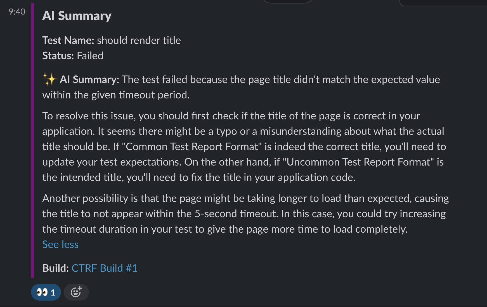

# AI Test Reporter

Generate AI test summaries using leading AI models from OpenAI and Anthropic Claude. Integrate with Developer tooling to provide AI summaries where you need them.

## **⭐⭐ If you find this project useful, consider giving it a GitHub star ⭐⭐**

## You can help us grow

Support our mission to enhance test reporting with AI summaries by:

- **⭐ Starring this repository to show your support. ⭐**
- **🙌 Following our [GitHub page here](https://github.com/ctrf-io) 🙌**

Thank you! Your support is invaluable to us! 💙

## Key Features

- Generate human-readable AI summaries for failed tests
- Use your own AI model, with support for OpenAI, Anthropic Claude and more soon
- Compatible with all major testing frameworks through standardized CTRF reports.
- Integrates AI with various CI/CD and developer tools.
- Customizable parameters like system prompt, model, temperature, max tokens, and more.
- Log AI generated summaries to the console.

## Usage

Generate a CTRF report using your testing framework. [CTRF reporters](https://github.com/orgs/ctrf-io/repositories) are available for most testing frameworks and easy to install.

**No CTRF reporter? No problem!**

Use [junit-to-ctrf](https://github.com/ctrf-io/junit-to-ctrf) to convert a JUnit report to CTRF

## OpenAI

Run the following command:

```bash
npx ai-ctrf openai <path-to-ctrf-report>
```

An AI summary for each failed test will be added to your test report.

The package interacts with the OpenAI API, you must set `OPENAI_API_KEY` environment variable.

You will be responsible for any charges incurred from using your selected OpenAI model. Make sure you are aware of the associated cost.

### Options

`--model`: OpenAI model to use (default: gpt-3.5-turbo).

`--systemPrompt`: Custom system prompt to guide the AI response.

`--frequencyPenalty`: OpenAI frequency penalty parameter (default: 0).

`--maxTokens`: Maximum number of tokens for the response.

`--presencePenalty`: OpenAI presence penalty parameter (default: 0).

`--temperature`: Sampling temperature (conflicts with topP).

`--topP`: Top-p sampling parameter (conflicts with temperature).

`--log`: Whether to log the AI responses to the console (default: true).

## Claude

Run the following command:

```bash
npx ai-ctrf claude <path-to-ctrf-report>
```

An AI summary for each failed test will be added to your test report.

The package interacts with the Anthropic API, you must set `ANTHROPIC_API_KEY` environment variable.

You will be responsible for any charges incurred from using your selected Claude model. Make sure you are aware of the associated costs.

### Claude Options

`--model`: Claude model to use (default: claude-3-5-sonnet-20240620).

`--systemPrompt`: Custom system prompt to guide the AI response.

`--maxTokens`: Maximum number of tokens for the response.

`--temperature`: Sampling temperature.

`--log`: Whether to log the AI responses to the console (default: true).

## GitHub Actions Integration

View AI summaries in directly in the Github Actions workflow:


Add a Pull Request comment with your AI summary:


## Slack Integration

Send a Slack message with your AI test summary:



## Support Us

If you find this project useful, consider giving it a GitHub star ⭐ It means a lot to us.
